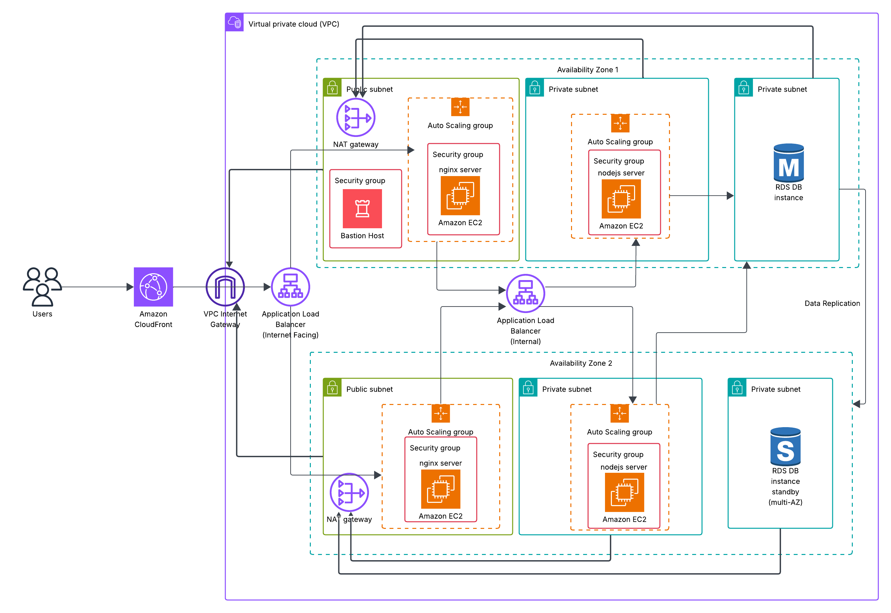

# 🚀 AWS Solution Architecture

A resilient and scalable web application infrastructure built across multiple Availability Zones using AWS services like CloudFront, Application Load Balancers, EC2 Auto Scaling, NAT Gateways, and a Multi-AZ RDS setup.

## 📚 Table of Contents

- Introduction  
- Architecture Overview  
- Service Components  
  - Amazon CloudFront  
  - VPC Design, Subnets & Networking  
  - Security Setup & Bastion Host  
  - Auto Scaling & Load Balancing  
  - Multi-AZ RDS Database  
- Application Flow  
- Availability & Resilience  
- Security Best Practices  

## 📌 Introduction

This project showcases a robust and scalable AWS-based web architecture, utilizing:

- CloudFront for fast, distributed content delivery  
- Public and private subnets distributed across two AZs  
- Independent Auto Scaling groups for NGINX and Node.js layers  
- External and internal ALBs to handle traffic  
- NAT gateways for secure outbound access  
- Amazon RDS (Multi-AZ) for reliable and consistent relational data storage

## 🖼️ Architecture Overview

**Figure 1:** A bird’s-eye view of a multi-AZ AWS web application environment, designed for high availability and failover protection.

## 🔍 Service Components

### Amazon CloudFront

- **Role:** Distributes static content closer to users by caching it at edge locations.  
- **Backend Origin:** Internet Gateway of VPC → Public ALB  

### VPC, Subnets & Networking

- **VPC CIDR Block:** 10.0.0.0/16  
- **Availability Zone 1:**  
  - Public Subnet: 10.0.1.0/24 (Hosts NGINX and NAT)  
  - Private Subnet: 10.0.2.0/24 (Node.js + internal ALB)  
  - DB Subnet: 10.0.3.0/24 (Primary RDS)  
- **Availability Zone 2:**  
  - Public Subnet: 10.0.4.0/24  
  - Private Subnet: 10.0.5.0/24  
  - DB Subnet: 10.0.6.0/24 (Standby RDS)  
- **NAT Gateways:** Deployed in each public subnet for outbound traffic routing  

### Security Groups & Bastion Host

- **Bastion Host:**  
  - Deployed in a public subnet  
  - Restricted SSH (TCP 22) access only from allowed IP addresses  
- **NGINX Security Group:**  
  - Allows inbound HTTP/HTTPS from CloudFront or Internet Gateway  
  - Communicates outbound with internal ALB  
- **Node.js Security Group:**  
  - Receives traffic from internal ALB on the app port (e.g., 3000)  
  - Connects outbound to RDS

### Auto Scaling & Load Balancing

#### NGINX Layer (Front-End, Public Subnets)

- **Auto Scaling:**  
  - Min: 2 instances  
  - Max: 6 instances  
  - Based on ALB traffic and CPU thresholds  
- **Internet-Facing ALB:**  
  - Routes user requests across NGINX nodes in both AZs  
  - Performs health checks on HTTP/HTTPS endpoints

#### Node.js Layer (App Tier, Private Subnets)

- **Auto Scaling:**  
  - Min: 2 instances  
  - Max: 6 instances  
  - Triggers based on usage metrics  
- **Internal ALB:**  
  - Accepts traffic from the NGINX layer  
  - Forwards to active Node.js instances  
  - Uses health checks like `/health` endpoint to determine instance status

### Load Balancer Request Flow

```
User
 ↓
CloudFront
 ↓
Public ALB (Internet-Facing)
 ↓
NGINX Auto Scaling Group
 ↓
Internal ALB
 ↓
Node.js Auto Scaling Group
 ↓
Amazon RDS (Multi-AZ)
```

### Amazon RDS (Multi-AZ)

- **Database Engine:** Aurora, MySQL, or PostgreSQL  
- **Deployment Type:**  
  - Primary DB in AZ1  
  - Standby replica in AZ2  
- **Subnet Group:** Includes DB subnets from both AZs  
- **Failover:** Automatic recovery during instance or zone failure

## 🔄 Application Flow

- CloudFront delivers static assets (JS, CSS, images) from edge locations  
- Dynamic requests are sent to the public ALB  
- NGINX handles SSL, routing, caching, and forwards requests internally  
- Node.js executes core app logic and connects to RDS  
- Any outbound calls (e.g., external APIs or updates) go through NAT gateways

## 🛠️ Availability & Resilience

- **Multi-AZ Deployment Across Tiers:**  
  - Load balancers and scaling groups span both AZs  
  - RDS configured in Multi-AZ for redundancy  
- **Health Monitoring:**  
  - ALBs check instance health and remove failed nodes from rotation  
- **Auto Scaling Policies:**  
  - Respond to traffic spikes (scale out)  
  - Conserve resources when idle (scale in)

## 🔐 Security Best Practices

- Use of minimal-permission security groups to control traffic  
- Only Bastion Host allows public SSH — all other EC2 instances remain private  
- EC2s assume IAM roles for secure interaction with AWS services  
- **Encryption:**  
  - RDS encryption via AWS KMS  
  - HTTPS enforced on all ALB endpoints  
- **Monitoring & Logging:**  
  - VPC Flow Logs  
  - CloudWatch metrics and dashboards  
  - ALB access logs for visibility  
